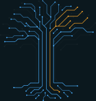
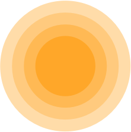
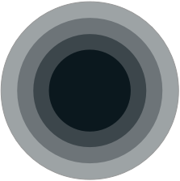

# QRL design assets

### Important

Please read the enclosed [LICENSE.md](https://github.com/theQRL/assets/blob/master/LICENCE.md) file for conditions of use.

Assets are generally presented in PNG and SVG format.

To preserve clarity we recommend the use of the SVG format where possible.

### Content

1. [Logo](logo/)
	
    a. [QRL Yellow](https://github.com/theQRL/assets/tree/master/logo/Yellow)  

	b. [QRL dark](logo/black.png)  

	
    c. [White](logo/white.png)  

2. [Icon](Icon/)

    a. [QRL Yellow](Icon/yellow)  

    b. [QRL dark](Icon/dark)  

    
    c. [White](Icon/white)  

3. [Dots](Dots/)

Available in multiple brand colours and shades.
 
   

4. [Tree](Tree/)

Available in with dark and transparent backgrounds
 
 

### Brand Colours

#### QRL Yellow

RGB: 255 / 167 / 41
Hex: #ffa729

#### QRL Blue

RGB: 74 / 175 / 255
Hex: #4aafff

#### QRL Dark

RGB: 11 / 24 / 30
Hex: #0b181e

#### QRL Light Blue

RGB: 203 / 215 / 230
Hex: #cbd7e6

### Additional requests

More will be added as and when they are requested.  Please open an issue on Github for any requests: please be as specific as possible with reference to size, colours, format etc.